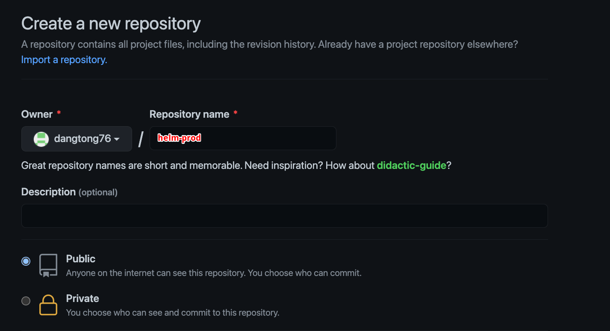
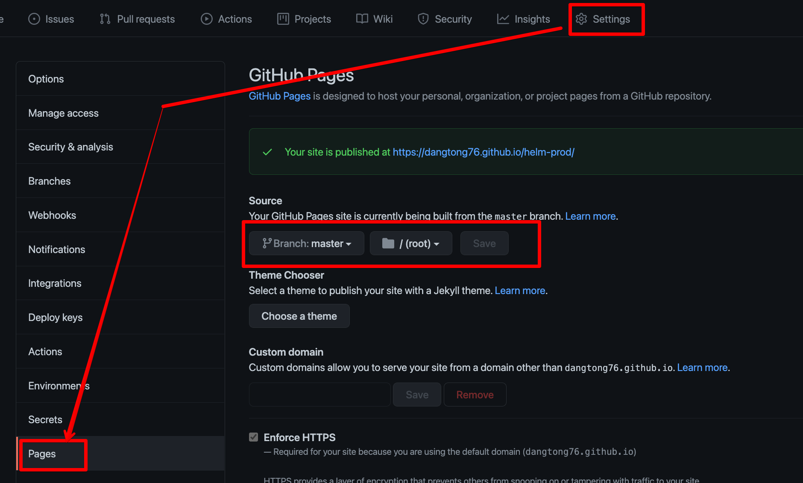

# Cloud Native를 위한 도커 와 쿠버네티스 7부 - Helm / Istio

## Helm 

### Helm 설치

#### 윈도우 설치 

- Chocolatey 설치 : PowerShell 을 열어서 아래 명령을 수행 합니다. 이미 google cloud sdk 를 설치 하면서 설치 되었을수 있습니다. 

```{cmd}
Set-ExecutionPolicy Bypass -Scope Process -Force; [System.Net.ServicePointManager]::SecurityProtocol = [System.Net.ServicePointManager]::SecurityProtocol -bor 3072; iex ((New-Object System.Net.WebClient).DownloadString('https://community.chocolatey.org/install.ps1'))
```

- Helm 설치

```{cmd}
choco install kubernetes-helm
```

#### Mac 설치

- 수동 설치 방법

```{bash}
# helm 다운로드
curl -fsSL -o get_helm.sh https://raw.githubusercontent.com/helm/helm/master/scripts/get-helm-3

# 실행권한 변경
chmod 700 get_helm.sh

# helm 설치
./get_helm.sh

# 버전 확인
helm version

# Helm Repository 추가
helm repo add stable https://charts.helm.sh/stable

# Repository 업데이트 
helm repo update
```

- Brew 설치

```{bash}
brew install helm
```

### Mysql Helm 차트 다운로드 및 설치 

#### mysql helm 검색

```{bash}
helm search repo stable/mysql

NAME            	CHART VERSION	APP VERSION	DESCRIPTION
stable/mysql    	1.6.3        	5.7.28     	Fast, reliable, scalable, and easy to use open-...
stable/mysqldump	2.6.0        	2.4.1      	A Helm chart to help backup MySQL databases usi...
```

#### 피키지 메타 정보 보기

```{bash}
helm show chart stable/mysql

apiVersion: v1
appVersion: 5.7.28
description: Fast, reliable, scalable, and easy to use open-source relational database
  system.
home: https://www.mysql.com/
icon: https://www.mysql.com/common/logos/logo-mysql-170x115.png
keywords:
- mysql
- database
- sql
maintainers:
- email: o.with@sportradar.com
  name: olemarkus
- email: viglesias@google.com
  name: viglesiasce
name: mysql
sources:
- https://github.com/kubernetes/charts
- https://github.com/docker-library/mysql
version: 1.6.3
```

#### mysql helm 차트 설치 및 Deployment

```{bash}
helm install stable/mysql --generate-name

AME: mysql-1588321002
LAST DEPLOYED: Fri May  1 08:16:55 2020
NAMESPACE: default
STATUS: deployed
REVISION: 1
NOTES:
MySQL can be accessed via port 3306 on the following DNS name from within your cluster:
mysql-1588321002.default.svc.cluster.local

To get your root password run:

    MYSQL_ROOT_PASSWORD=$(kubectl get secret --namespace default mysql-1588321701 -o jsonpath="{.data.mysql-root-password}" | base64 --decode; echo)

To connect to your database:

1. Run an Ubuntu pod that you can use as a client:

    kubectl run -i --tty ubuntu --image=ubuntu:16.04 --restart=Never -- bash -il

2. Install the mysql client:

    $ apt-get update && apt-get install mysql-client -y

3. Connect using the mysql cli, then provide your password:
    $ mysql -h mysql-1588321701 -p

To connect to your database directly from outside the K8s cluster:
    MYSQL_HOST=127.0.0.1
    MYSQL_PORT=3306

    # Execute the following command to route the connection:
    kubectl port-forward svc/mysql-1588321002 3306

    mysql -h ${MYSQL_HOST} -P${MYSQL_PORT} -u root -p${MYSQL_ROOT_PASSWORD}
```

```{bash}
helm ls

NAME                    NAMESPACE       REVISION        UPDATED                                 STATUS         C
HART            APP VERSION
mysql-1588321701        default         1               2020-05-01 17:28:25.322363879 +0900 +09 deployed       m
ysql-1.6.3      5.7.28
```

#### Helm 차트 삭제

```{bash}
heml list

NAME                    NAMESPACE       REVISION        UPDATED                                 STATUS         C
HART            APP VERSION
mysql-1588321701        default         1               2020-05-01 17:28:25.322363879 +0900 +09 deployed       m
ysql-1.6.3      5.7.28


helm uninstall mysql-1588321701
release "mysql-1588321701" uninstalled
```

### Helm 차트 만들기

#### Helm 차트 생성

```{bash}
helm create nginxstd
```

#### Template 파일 수정

- Charts.yaml 파일 수정

```{bash}
apiVersion: v2
name: nginx-std
description: A Helm chart for Kubernetes
type: application
version: 0.1.0
appVersion: "1.16.0"
```

- Template/deployment.yaml 파일 생성

```{yaml}
apiVersion: apps/v1
kind: Deployment
metadata:
  name: {{ .Values.container.name }}
spec:
  replicas: {{ .Values.replicas }}
  selector:
    matchLabels:
      app: {{ .Values.container.name }}
  template:
    metadata:
      labels:
        app: {{ .Values.container.name }}
        environment: {{ .Values.environment }}
    spec:
      containers:
        - name: {{ .Values.container.name }}
          image: {{ .Values.container.image }}:{{ .Values.container.tag }}
          ports:
            - containerPort: {{ .Values.container.port }}
          env:
            - name: environment
              value: {{ .Values.environment }}
```

- template/service.yaml 파일 생성

```{yaml}
apiVersion: v1
kind: Service
metadata:
  name: {{ .Values.container.name }}-service
  labels:
    app: {{ .Values.container.name }}
spec:
  ports:
  - port: 80
    protocol: TCP
    targetPort: {{ .Values.container.port }}
  selector:
    app: {{ .Values.container.name }}
  type: LoadBalancer
```

- values.yaml 파일 생성

```{yaml}
environment: development
container:
  name: nginx
  port: 80
  image: nginx
  tag: latest
replicas: 2
```

#### 테스트 하기

- K8s 오브젝트 생성

```{bash}
helm install nginxstd ./nginxstd
```

- 삭제

```{bash}
# 확인
kubectl get all
helm list

# 삭제 
helm uninstall nginxstd
```

### 패키지 및 리포지토리 생성

#### 패키지 생성

```{bash}
helm package ./nginxstd

mkdir prod
mv ./nginx-std-0.1.0.tgz ./prod/
```

#### helm 리포지토리 파일 생성

```{bash}
# 리포지토리 파일 생성 (index.yaml)
heml repo index ./prod

# 파일 생성 확인
cat ./prod/index.yaml
```


### Helm 패키지 및 Repository 구성하기

#### Github.com Repository 생성

- repository 생성



- github page 설정



#### Git repository 생성 및 동기화

```{bash}
cd prod

git init

git add .

git commit -a -m "initial commit"

git remote add origin https://github.com/dangtong76/helm-prod.git

git push origin master
```

#### Helm 리포지토리 구성 및 추가 

- Git page 로 서비스 되는 Git 리포지토리를 Helm 리포지토리에 추가

```{bash}
helm repo add helm-prod https://dangtong76.github.io/helm-prod
```

- 추가확인

```{bash}
helm repo list

helm search repo nginx
```

<<<<<<< HEAD:[실습] Cloud Native를 위한 도커 와 쿠버네티스 8부 - Helm차트:Istio.md
#### Helm 리포지토리에 Postgresql 추가 
=======
### 1.5.4 Helm 리포지토리에 redis 추가 
>>>>>>> b00306cc139b25b71f4c2a8e53720fa5e25abd4b:Istio_Docker_Add.md

- redis 안정버전 차트를 로컬 prod 디렉토리에 다운로드 

```{bash}
helm search repo redis

helm fetch stable/redis -d ./prod
```

- index.yaml 갱싱

```{bash}
helm repo index ./prod
```

- git 업데이트

```{bash}
git status

git add .

git commit -a -m "add redis"

git push origin master
```

- helm update 수행 

```{bash}
helm repo update

helm search repo redis
```

> 업데이트 없이 "helm search repo redis" 를 검색하면 검색이 되지 않습니다.

### Helm 차트 업그레이드

#### Repository 를 통한 Helm 인스톨

```{bash}
helm list

helm install nginxstd helm-prod/nginx-std
# 또는 
helm install helm-prod/nginx-std --generate-name

#확인
helm status nginxstd
kubectl get all 
```

#### helm 메니페스트를 통한 차트 변경 및 업데이트

- stage-values.yaml 파일 생성

```{bash}
environment: development
replicas: 4
```

- helm upgrade 로 차트 변경 적용

```{bash}
helm upgrade -f ./nginxstd/stage-values.yaml nginxstd helm-prod/nginx-std
```

- helm history 로 확인

```{bash}
helm history
```

- RollBack 수행

```{bash}
helm rollback nginxstd 1
```

- Rollback 확인

```{bash}
helm history nginxstd

helm helm status nginxstd

kubectl get po 
```


#### Helm CLI 옵션을 통한 업그레이드

- 현재 차트의 value 를 화인

```{bash}
helm show values helm-prod/nginx-std

environment: development
container:
  name: nginx
  port: 80
  image: nginx:1.7.9
  tag: hello
replicas: 2
```

- CLI 옵션을 통한 업그레이드 

```{bash}
helm upgrade --set replicas=4 --set environment=dev nginxstd helm-prod/nginx-std
```

- 확인 

```{bash}
helm history

helm status nginxstd

kubectl get po
```

### 삭제

 

```{bash}
helm uninstall nginxstd
```

### 연습문제

> 1. helm-myrepo 라는 디렉토리를 만드세요
>
> 2. nodes-sts 라는 이름으로 heml 차트를 생성 하세요
>
> 3. 아래 아래 3개의 yaml 파일에 대해 helm 차트를 구성하고 려고 합니다.
>
>    파일명 : sts-lb.yaml / sts-sc.yaml / sts.yaml
>
> 4.  변수화 할 항목은 아래와 같습니다.
>
>    1. sts.yaml 에서 변수처리
>       1. Spec.template.spec.containers.name
>       2. Spec.template.spec.containers.image
>       3. Spec.template.spec.containers.ports.containerPort
>       4. Spec.template.spec.containers.volumeMounts.name
>       5. Spec.template.spec.containers.volumeMounts.mountPath
>       6. Spec.volumeClaimTemplates.metadata.name
>       7. Spec.volumeClaimTemplates.spec.resources.requests.storage
>       8. Spec.volumeClaimTemplates.spec.accessModes
>       9. Spec.volumeClaimTemplates.spec.storageClassName
>    2. sts.lb.yaml 에서 변수처리 
>       1. metadata.name
>       2. Spec.ports.port
>       3. Spec.ports.targetPort
>    3. sts-sc.yaml 에서 변수처리 
>       1. reclaimPolicy
>       2. Parameters.type
>       3. Parameters.zone
>
> 5. Github.com 에 helm-myrepo 라는 이름으로 리포지토리를 생성하세요
>
> 6. nodes-sts 라는 helm 패키지를 생성하고 helm-myrepo 내에 패키지를 복사하세요
>
> 7. helm 리포지토리를 생성 하세요 (index.yaml 생성)
>
> 8. helm-myrepo 내에 git repository 를 초기화 하고 Commit 후에 GitHub.com 관 연동 하세요
>
> 9. github.com 의 helm-myrepo  리포지토리를 helm 리포지토리에 추가하세요
>
> 10. nodes-sts  heml 설치 차트를 설치하세요.

<<<<<<< HEAD:[실습] Cloud Native를 위한 도커 와 쿠버네티스 8부 - Helm차트:Istio.md
| 항목 카네토리 | 항목 |
| ------------- | ---- |
| sts.yaml      | Sepc |

#### 3개 파일
=======


### 1.8.1 3 3개 파일
>>>>>>> b00306cc139b25b71f4c2a8e53720fa5e25abd4b:Istio_Docker_Add.md

- sts.yaml

```{yaml}
apiVersion: apps/v1
kind: StatefulSet
metadata:
  name: nodejs-sfs
spec:
  selector:
    matchLabels:
      app: nodejs-sfs
  serviceName: nodejs-sfs
  replicas: 2
  template:
    metadata:
      labels:
        app: nodejs-sfs
    spec:
      containers:
      - name: nodejs
        image: dangtong76/nodejs
        ports:
        - name: http
          containerPort: 8080
        volumeMounts:
        - name: data
          mountPath: /var/data
  volumeClaimTemplates:
  - metadata:
      name: data
    spec:
      resources:
        requests:
          storage: 1Mi
      accessModes:
      - ReadWriteOnce
      storageClassName: sc-standard-retain
```

- sts-sc.yaml

```{yaml}
apiVersion: storage.k8s.io/v1
kind: StorageClass
metadata:
  name: sc-standard-retain
provisioner: kubernetes.io/gce-pd
reclaimPolicy: Retain
parameters:
  type: pd-ssd
  zone: asia-northeast3-a
```

- sts-lb.yaml

```{yaml}
apiVersion: v1
kind: Service
metadata:
    name: nodesjs-sfs-lb
spec:
    type: LoadBalancer
    ports:
    - port: 80
      targetPort: 8080
    selector:
        app: nodejs-sfs
```


## Istio

### Istio 설치 

#### 설치전 플랫폼별 설정

> 참고 URL : https://istio.io/latest/docs/setup/platform-setup/
>
> 위 링크에 들어가면 플랫폼별 Istio 사전 설치 셋업 관련 정보를 확인 할 수 있습니다.

#### kubectl 클라이언트 Credential 설정

```{bash}
 gcloud container clusters get-credentials $CLUSTER_NAME \
    --zone $ZONE \
    --project $PROJECT_ID
```

#### 클러스터 롤 설정

```{bash}]
kubectl create clusterrolebinding cluster-admin-binding \
    --clusterrole=cluster-admin \
    --user=$(gcloud config get-value core/account)
```

#### 타사 토큰 지원 확인

```{bash}
kubectl get --raw /api/v1 | jq '.resources[] | select(.name | index("serviceaccounts/token"))'


# 아래와 같이 결과가 나와야함
{
  "name": "serviceaccounts/token",
  "singularName": "",
  "namespaced": true,
  "group": "authentication.k8s.io",
  "version": "v1",
  "kind": "TokenRequest",
  "verbs": [
    "create"
  ]
}
```


### Istio 환경 변수 설정 및 다운로드 

#### Istio 다운로드

```{bahs}
curl -L https://istio.io/downloadIstio | sh -

curl -L https://istio.io/downloadIstio | ISTIO_VERSION=1.6.8 TARGET_ARCH=x86_64 sh -
```

#### 설치전 환경변수 설정

```{bash}
cd istio-1.10.3
export PATH=$PWD/bin:$PATH
```

### Istio 설치 with Helm

#### Namespace 생성 및 istio-injection 라벨 추가

```{bash}
kubectl create namespace istio-system
kubectl label namespace default istio-injection=enabled
```

#### Base Chart 를 통한 Istio Control Plane 에 설치될 컨테이너 설치

```{bash}
helm install istio-base manifests/charts/base -n istio-system
```

#### Discovery Chart 를 통한 Istiod 설치 

```{bash}
helm install istiod manifests/charts/istio-control/istio-discovery -n istio-system
```

#### Istio Ingress Gateway 설치(옵션)

```{bash}
helm install istio-ingress manifests/charts/gateways/istio-ingress -n istio-system
```

#### Istio Egress Gateway (옵션)

```{bash}
helm install istio-egress manifests/charts/gateways/istio-egress -n istio-system
```

#### 설치 확인

```{bash}
kubectl get pods -n istio-system
```

### Prometheus / Jeager / Grapana /  Kiali 설치

#### Prometheus / Jeager / Grapna설치

```{bash}
cd <istion_install_dir>
cd samples/addones

kubectl apply -f samples/addons/prometheus.yaml
kubectl apply -f samples/addons/jaeger.yaml
kubectl apply -f samples/addons/grafana.yaml
```

#### Kiali 설치

```{bash}
kubectl apply -f samples/addons/kiali.yaml
```

#### 서비스 설치 확인

```{bash}
kubectl get all -n istio-system
```

#### 서비스 접속

```{bash}
kubectl port-forward service/kiali 20001:20001 -n istion-system
```

브라우저에 http://localhost:20001 로 접속

### Sample Application 설치

#### 설치

istion. 설치 바이너리 디렉토리에서 Samples 디렉토리 밑에 테스트 애플리케이션이 있다.

```{bash}
cd {istio_binary_dir}
kubectl apply -f samples/bookinfo/platform/kube/bookinfo.yaml
kubectl apply -f samples/bookinfo/networking/bookinfo-gateway.yaml
```

#### 서비스 확인

```{bash}
 kubectl exec "$(kubectl get pod -l app=ratings -o jsonpath='{.items[0].metadata.name}')" -c ratings -- curl -sS productpage:9080/productpage | grep -o "<title>.*</title>"
<title>Simple Bookstore App</title>
```

#### Transaction 발생 시키기

### Istio 및 서비스 삭제

#### 서비스 삭제

```{bash}
kubectl delete -f samples/addons/kiali.yaml
kubectl delete -f samples/addons/grafana.yaml
kubectl delete -f samples/addons/jaeger.yaml
kubectl delete -f samples/addons/prometheus.yaml
```

#### Istio 삭제 

```{bash}
helm delete istio-egress -n istio-system
helm delete istio-ingress -n istio-system

# delete Istio discovery chart
helm delete istiod -n istio-system

# delete Istion base chart
helm delete istio-base -n istio-system

# delete Istion istio-system namespace
kubectl delete namespace istio-system

# delelte CustomResourceDefinitions(CRD)
kubectl get crd | grep --color=never 'istio.io' | awk '{print $1}' \
    | xargs -n1 kubectl delete crd
    
# delete label
kubectl label namespace default istio-injection=enabled -
```


## 로컬  k8s 클러스터 설치 

### Vagrant 설치 

https://www.vagrantup.com/downloads 에서 운영체제 버전에 맞는 Vagrant 를 설치 합니다.

> 윈도우의 경우 hyper-v 활성화를 아래 명령을 통해 해야 합니다.
>
> Disable-WindowsOptionalFeature -Online -FeatureName Microsoft-Hyper-V-All

>설치 사전요구사항으로 아래 소프트웨어 설치 되어야함
>
>* Vagrant (https://www.vagrantup.com/)
>* VirtualBox (https://www.virtualbox.org/)
>* kubectl (https://kubernetes.io/docs/tasks/tools/install-kubectl/)
>* git (https://kubernetes.io/docs/tasks/tools/install-kubectl/)

